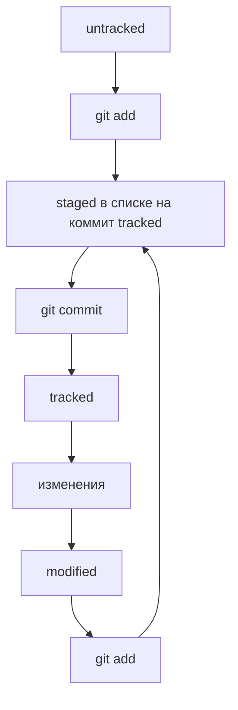

# Second project
### Yandex Git lessons

```mermaid

    graph TD;
        A[untracked]-->B[git add];
        B[git add]-->C[staged в списке на коммит tracked];
        C[staged в списке на коммит tracked]-->D[git commit];
        D[git commit]-->E[tracked];
        E[tracked]-->F[изменения];
        F[изменения]-->G[modified];
        G[modified]-->H[git add];
        H[git add]-->C[staged в списке на коммит tracked];
```
